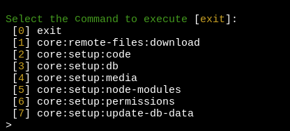
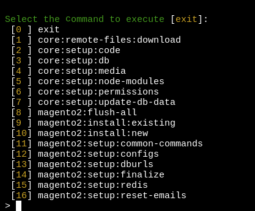
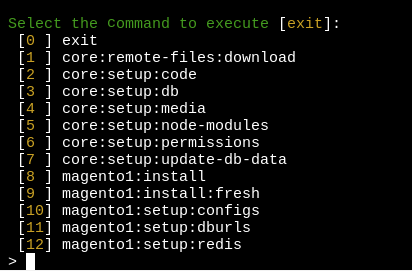
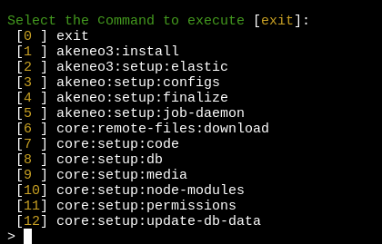
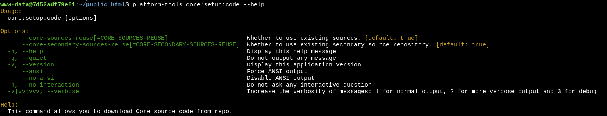

# DevBox platform tools

Platform-tools is group of composer packages to perform most popular actions with project platform automatically using pre-configured settins from the project file '.env-project.json'

Platform-tools are available inside website container using alias `platform-tools`. They also executed in the end of project starting as remote command to website container.

The platform tools installed by the "composer install" command are based on composer.json files. These can be described as any repositories you want to use as utilities responsible for upping the project inside the web container. Inside .env files, you can describe the path to the platform-tools folder, and the path inside web container where these tools will be mapped.

Active platform tools package depends on chosen parameter `TOOLS_PROVIDER_ENTRYPOINT` in your project '.env'

## Platform tools entrypoints

Example of core tools menu:
```dotenv

TOOLS_PROVIDER_ENTRYPOINT=ewave/devbox-core-scripts/coreinit
```



Example of Magento 2 tools menu:
```dotenv
TOOLS_PROVIDER_ENTRYPOINT=ewave/devbox-m2-scripts/m2init
```



Example of Magento 1 tools menu:
```dotenv
TOOLS_PROVIDER_ENTRYPOINT=ewave/devbox-m1-scripts/m1init
```



Example of Akeneo tools menu:
```dotenv
TOOLS_PROVIDER_ENTRYPOINT=ewave/devbox-akeneo2-scripts/akeneo3init
```


## How to show command details

You can get more details for every command using default symfony `--help` option added to required command inside web container.

```bash
platform-tools <commad_name> --help
```
For example the following command
```bash
platform-tools core:setup:code --help
```
shows the output


# Command descriptions

>!!!! TODO !!!!

## Core commands (common for all entrypoints)

### Command `core:remote-files:download`

This command downloads predefined files from your remote storage and puts them to the configured directory.
See the related configuration subsection `sources->files_mapping` in [How to configure .env-project.json](project_env_project_json.md) 

### Command `core:setup:code`

This command downloads project source code from your repository to use inside web container.
See the related configuration subsection `sources->code` in [How to configure .env-project.json](project_env_project_json.md)

### Command `core:setup:db`

This command downloads predefined database dump and import it into database container.
See the related configuration subsection `sources->db` in [How to configure .env-project.json](project_env_project_json.md)

### Command `core:setup:media`

This command downloads predefined media files from your storage and puts them to media folder of your web container.
Files could be stored as a vcs repository or just in zip archive on some server. Platform tools extract archive into corresponding folder for you.  
See the related configuration subsection `sources->media` in [How to configure .env-project.json](project_env_project_json.md)

### Command `core:setup:node-modules`

This command performs node_modules installation using the given package manager inside web container using command "{package_manager} install --force".
In case required file "package.json" tools try to find "package.json.sample" instead.

Also, it creates symlink from to separate internal folder '/var/www/node_modules_remote' which can be synchronized with host system using unison.
This is done to split synchronization of project source code and huge node_modules directory and make application code sync faster and more convenient.
Also pay attention not application could work with symlinked folder. In this case you can disable symlink and use common sync storage.  
See the related configuration subsection `configuration->node_modules` in [How to configure .env-project.json](project_env_project_json.md)

### Command `core:setup:permissions`

This command expands permissions to 777 with changing file owner to www-data user for all working directories mentioned in your .env.project.json.
You can use this command if you see 'permission denied' error by accessing project files.
See the related configuration subsection `base_params->working_directories` in [How to configure .env-project.json](project_env_project_json.md)

### Command `core:setup:update-db-data`

Using this command you can perform some number of base SQL queries defined in json format.
You can run this command after database dump import to align some specific settings or update some specific records in your database. 
See the related configuration subsection `sources->update_db_data` in [How to configure .env-project.json](project_env_project_json.md)

## Magento 2 commands

### Command `magento2:flush-all`

This command cleans Magento cache, static files, generated code and flushes Redis cache

It executes command:
```bash
rm -rf var/cache/* var/page_cache/* pub/static/* generated/*
```
In case Redis host is available it also calls flushall on redis host
```bash
redis-cli flushall
```

### Command `magento2:install:existing`

This command performs installation of your Magento application from existing source files, database dump and configs.
The following command chain will be executed.
```
core:setup:permissions,
core:setup:code,
core:setup:media,
magento2:setup:configs,
core:setup:db,
core:setup:update-db-data,
magento2:setup:dburls,
magento2:setup:reset-emails,
magento2:setup:db-sales-prefixes,
magento2:setup:common-commands,
magento2:setup:finalize,
magento2:setup:redis,
core:setup:permissions
```

### Command `magento2:install:new`

This command performs installation of your fresh Magento application from existing sources.
You need just to specify a required source for application code. Then package installs Magento 2 instance using command 
'php bin/magento setup:install' with required arguments, prepares required folders, configure rabbitmq/redis hosts if available 
and deploys sample data.


### Command `magento2:setup:common-commands`

This command will prepare your local Magento 2 configuration for development.
It means in the table 'core_config_data' updating of config paths:
- disable dev/static/sign
- disable for dev/js/merge_files
- disable for dev/css/merge_css_files
- removes custom admin url added by params 'admin/url/use_custom', 'admin/url/custom', 'admin/url/use_custom_path', 'admin/url/custom_path'
- disable web/secure/use_in_frontend
- disable web/secure/use_in_adminhtml
- create local admin user with credentials: admin/ewave123

### Command `magento2:setup:configs`

This command downloads predefined Magento 2 configs from your remote storage and puts them to the configured directory 
like it is done by command 'core:remote-files:download'.
Also additionally it updates main database hosts in the config.php accdoring to your environment configuration, 
creates a new config.php if it was missing and sets required permissions.

### Command `magento2:setup:db-sales-prefixes`

This command updates prefixes in the database table 'sales_sequence_profile' and optionally it can update 'increment_id'
for existing records in all base Magento 2 sales tables (e.g. sales_order, sales_invoice, etc.)
See the related configuration subsection `sources->sales_prefix_mapping` in [How to configure .env-project.json](project_env_project_json.md)

### Command `magento2:setup:dburls`

This command updates Magento host addresses 'web/secure/base_url' and 'web/unsecure/base_url' in your core_config_data according to the given mapping.
In case domains mapping is not configured then params '*/base_url' will be set according to params WEBSITE_HOST_NAME and WEBSITE_PROTOCOL from project .env file.
See the related configuration subsection `sources->domains_mapping` in [How to configure .env-project.json](project_env_project_json.md)

### Command `magento2:setup:finalize`

This command performs last actions for local development.
It optionally calls (will ask for your confirmation):
- set magento mode to 'developer' using `bin/magento deploy:mode:set developer`
- enables all modules in case 'config.php' is missing using command `bin/magento module:enable --all`
- calls static content deployment using command `php bin/magento setup:static-content:deploy -f`
- adds magento crons to crontab
- calls DI compilation using command `php bin/magento setup:di:compile`
- enables varnish if available using command `bin/magento setup:config:set --http-cache-hosts=...`
- installs database migrations using command `php bin/magento setup:upgrade`
- cleans magento cache using command `php bin/magento cache:clean`

### Command `magento2:setup:redis`

This command updates your 'env.php' with Redis storage if possible and enables related Redis storages like sessions, 
page cache, full page cache. Also, it flushes magento cache in the end to apply new settings.

### Command `magento2:setup:reset-emails`

This command updates database email addresses for all found column 'email', 'customer_email' to fake addresses to 
prevent any unexpected email sending during local development.

## Magento 1 commands

### Command `magento1:install`
This command performs installation of your Magento 1 application from existing source files, database dump and configs.
The following command chain will be executed.
```
core:setup:permissions,
core:setup:code,
core:setup:media,
magento1:setup:configs,
core:setup:db,
core:setup:update-db-data,
magento1:setup:dburls,
magento1:setup:redis,
core:setup:permissions
```

### Command `magento1:install:fresh`

This command performs installation of your fresh Magento application from existing sources.
You need just to specify a required source for application code. Then package installs Magento 2 instance using command
'php -f install.php' with required arguments, prepares required folders, configure redis hosts if available.

### Command `magento1:setup:configs`

This command updates application config 'app/etc/local.xml' with main database settings according to your environment configuration.

### Command `magento1:setup:dburls`

This command updates Magento host addresses 'web/secure/base_url' and 'web/unsecure/base_url' in your table 'core_config_data' 
according to the params WEBSITE_HOST_NAME and WEBSITE_PROTOCOL from your project .env.

### Command `magento1:setup:redis`

This command updates application config 'app/etc/local.xml' with main redis settings according to your environment configuration.
This includes using redis to store session data or enabling redis as application cache storage.

## Akeneo commands

### Command `akeneo:setup:configs`

This command is not anymore relevant for Akeneo 4+ instances as 'parameters.yml' was replaced with application '.env' config by vendor.

This command downloads predefined Akeneo configs from your remote storage and puts them to the configured directory
like it is done by command 'core:remote-files:download'.
Additionally it updates main database hosts in the 'app/config/parameters.yml' according to your environment configuration 
and sets required permissions.

### Command `akeneo:setup:finalize`

This command performs last actions for local development.
It optionally calls (will ask for your confirmation):
- clears application cache using command `bin/console cache:clear`
- generates static assets using command `php bin/console pim:installer:assets -e prod --clean`
- build webpack package using command `yarn run webpack`

### Command `akeneo:setup:job-daemon`

This command starts akeneo job daemon process as background process. 
In case you need to have several queue watchers just run this command as many times as you need.
Job daemon is executed using command `php bin/console akeneo:batch:job-queue-consumer-daemon > /dev/null 2>&1 &`

Also you can start daemon on project start. To do this just add this command to autostart section in your .env-project.json.
See the related configuration section `auto_start_commands` in [How to configure .env-project.json](project_env_project_json.md)
```json
    "auto_start_commands": {
        "core:setup:permissions": "1",
		"akeneo:setup:job-daemon": "1"
    }
```

### Command `akeneo2:install`

This command performs installation of your Akeneo 2 application from existing source files, database dump and configs.
The following command chain will be executed.
```
core:setup:permissions,
core:setup:code,
core:setup:media,
akeneo:setup:configs,
core:setup:db,
akeneo2:setup:elastic,
core:setup:node-modules,
akeneo:setup:finalize,
akeneo:setup:job-daemon,
core:setup:permissions,
```

### Command `akeneo2:setup:elastic`

Using this command it is possible to import indices data from ES dump files using npm elasticdump package. (todo move install from dump to global level)
See the related configuration subsection `sources->es` in [How to configure .env-project.json](project_env_project_json.md)

Otherwise this command resets ElasticSearch indices data and performs fresh reindex of your mysql data for Akeneo 2 version.
This is handled using commands:
```bash
php bin/console akeneo:elasticsearch:reset-indexes -n
php bin/console pim:product-model:index --all -n
php bin/console pim:product:index --all -n
php bin/console pimee:published-product:index -n
php bin/console pimee:product-proposal:index -n
```

### Command `akeneo3:install`

This command performs installation of your Akeneo 3 application from existing source files, database dump and configs.
The following command chain will be executed.
```
core:setup:permissions,
core:setup:code,
core:setup:media,
akeneo:setup:configs,
core:setup:db,
akeneo3:setup:elastic,
core:setup:node-modules,
akeneo:setup:finalize,
akeneo:setup:job-daemon,
core:setup:permissions,
```

### Command `akeneo3:setup:elastic`

Using this command it is possible to import indices data from ES dump files using npm elasticdump package. (todo move install from dump to global level)
See the related configuration subsection `sources->es` in [How to configure .env-project.json](project_env_project_json.md)

Otherwise this command resets ElasticSearch indices data and performs fresh reindex of your mysql data for Akeneo 3 version.
In case ewave bundles installed with custom commands `ewave:product:index` and `ewave:product-model:index` then call them as more effective because of performance reasons. 
This is handled using commands:
```bash
php bin/console akeneo:elasticsearch:reset-indexes -n
php php bin/console akeneo:reference-entity:index-records --all -n
(php bin/console ewave:product-model:index --help >/dev/null 2>&1 && php bin/console ewave:product-model:index --all -n || php bin/console pim:product-model:index --all -n)
(php bin/console ewave:product:index --help >/dev/null 2>&1 && php bin/console ewave:product:index --all -n || php bin/console pim:product:index --all -n)
php bin/console pimee:published-product:index -n
php bin/console pimee:product-proposal:index -n
```

### Commands for Akeneo 4,5 coming soon
