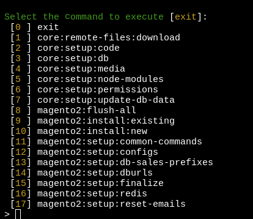

## DevBox platform tools

Platform-tools is group of composer packages to perform most popular actions with project platform automatically using pre-configured settins from the project file '.env-project.json'

Platform-tools are available inside website container using alias `platform-tools`. They also executed in the end of project starting as remote command to website container.

The platform tools installed by the "composer install" command are based on composer.json files. These can be described as any repositories you want to use as utilities responsible for upping the project inside the web container. Inside .env files, you can describe the path to the platform-tools folder, and the path inside web container where these tools will be mapped.

Active platform tools package depends on chosen parameter `TOOLS_PROVIDER_ENTRYPOINT` in your project '.env'

Example of core tools menu:
```dotenv

TOOLS_PROVIDER_ENTRYPOINT=ewave/devbox-core-scripts/coreinit
```


Example of Magento 2 tools menu:
```dotenv
TOOLS_PROVIDER_ENTRYPOINT=ewave/devbox-m2-scripts/m2init
```



Example of Magento 1 tools menu:
```dotenv
TOOLS_PROVIDER_ENTRYPOINT=ewave/devbox-m1-scripts/m1init
```


Example of Akeneo tools menu:
```dotenv
TOOLS_PROVIDER_ENTRYPOINT=ewave/devbox-akeneo2-scripts/akeneo3init
```


