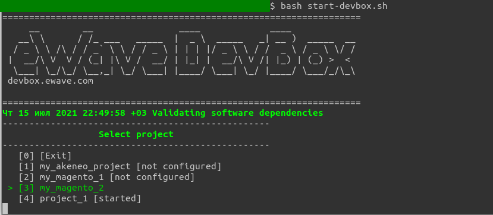
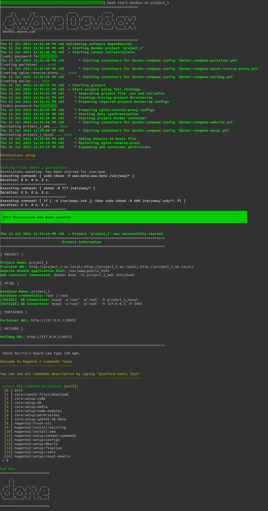
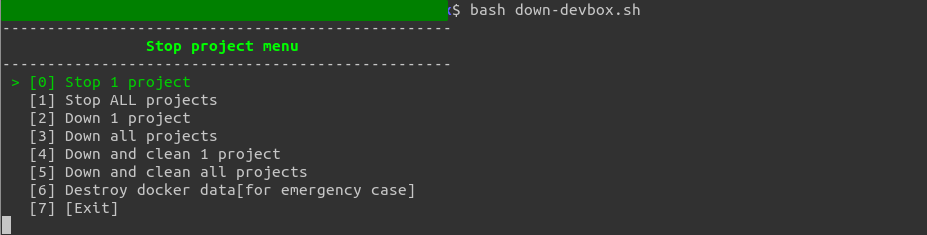
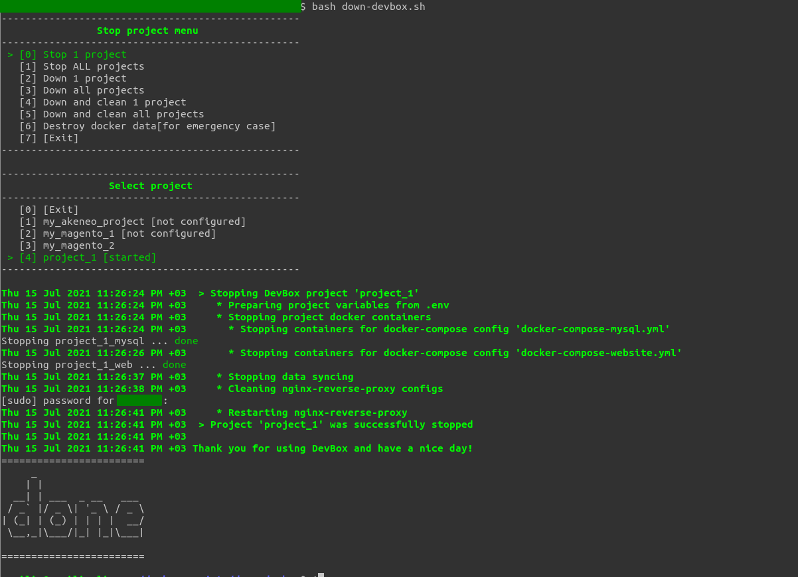
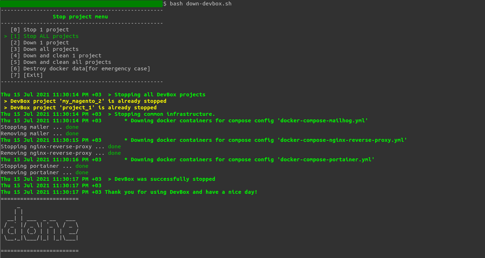
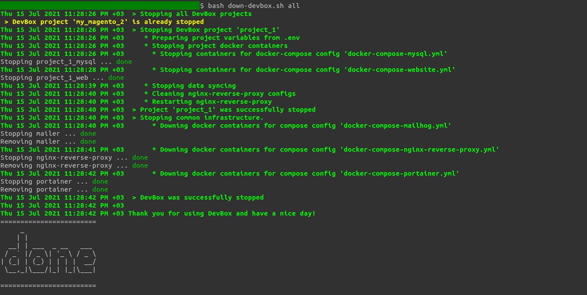
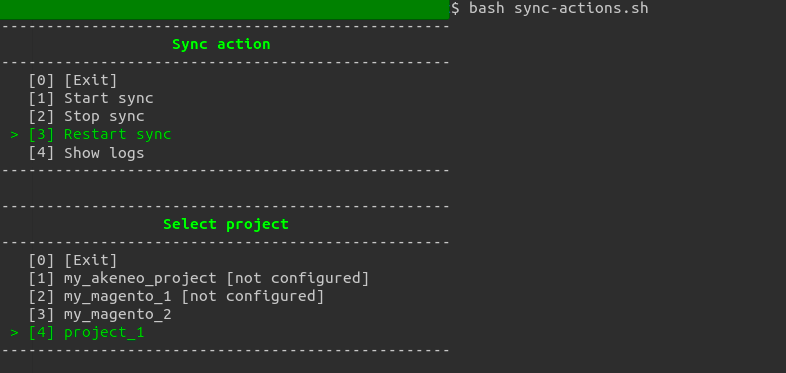

# How to interact with DevBox

DevBox project has 2 main entrypoint scripts and one additional:

Main commands:
- start-devbox.bat (Windows) or start-devbox.sh (MacOs, Linux)

- down-devbox.bat (Windows) or down-devbox.sh (MacOs, Linux)

Additional for service usage:
- sync-actions.bat (Windows) or sync-actions.sh (MacOs, Linux)

Actually all what you need for regular work is running of either script `start-devbox` or `down-devbox`.
Then you can operate with required project actions using interactive menus.

--------------------------
Actually most popular commands you need:

To start project:
run `start-devbox` -> choose your project to be started

To stop project:
run `down-devbox` -> select `Stop 1 project`  -> choose your project to be stopped

To stop all projects:
run `down-devbox` -> select `Stop ALL projects`

And that is it you need to interact with DevBox, pretty easy as you can see. ;)

But actually if you would like to have a bit more details about those actions please refer to descriptions below.

--------------------------
--------------------------
# Detailed command description

## start-devbox.bat (Windows) / start-devbox.sh (MacOs, Linux) 

### Usage

Windows:
```cmd
start-devbox.bat
start-devbox.bat [project_name]
```

MacOs / Linux:
```bash
bash start-devbox.sh
bash start-devbox.sh [project_name]

zsh start-devbox.sh
zsh start-devbox.sh [project_name]

zsh start-devbox.sh
zsh start-devbox.sh [project_name]

```

### Description
start-devbox - entrypoint to start existing and configured projects from the directory `{devbox_root}/projects/`.

You can start it without any arguments. In this case you will be asked to choose project from the list.
You can pass the project name string as the first argument. In this case the given project will start immediately.

All DevBox menus supports number-based or narrow-based navigation.


After selecting the required project DevBox will prepare necessary configuration files and docker containers for you
based on configuration files '.env' and '.env-project.json' 
(see articles [How to configure project .env file](how_to_configure_project_dotenv.md) and [How to configure .env-project.json](how_to_configure_project_env_project_json.md) )

The full example of project starting operations:



--------------------------
## down-devbox.bat (Windows) or down-devbox.sh (MacOs, Linux)

### Usage

Windows:
```cmd
down-devbox.bat
down-devbox.bat [project_name]
```

MacOs / Linux:
```bash
bash down-devbox.sh
bash down-devbox.sh [project_name | 'all' ]

zsh down-devbox.sh
zsh down-devbox.sh [project_name | 'all' ]

zsh down-devbox.sh
zsh down-devbox.sh [project_name | 'all' ]

```

### Description
down-devbox - entrypoint to stop/shutdown your project with or without cleaning of synced docker files.

Project list also generated based on existing and configured projects from the directory `{devbox_root}/projects/`.
You can pass the project name string as an argument to terminate one project or pass string 'all' to terminate all running projects.

Shutdown menu:


Actions:
- `[0] Stop 1 project` - it just stops all working processes and bring containers into 'stopped' state without destroying any data of configuration files.
The is operation for regular usage. Also, stop will be performed as a default operation with a project name as command line argument.

- `[1] Stop ALL projects` - stoping of all running projects and also infrastructure services (e.g. portainer, mailer, nginx reverse proxy)

- `[2] Down 1 project` - full shutdown of a project with removal of prepared configuration files from 'docker-up' and downing containers. Only keeps the external volumes data.
By the next start all configuration files will be re-generation and containers will be created again with new params. Doesn't affect the project files on your host OS. 

- `[3] Down all projects` - full shutdown of all running projects and also infrastructure services (e.g. portainer, mailer, nginx reverse proxy)

- `[4] Down and clean 1 project` - similar to `Down 1 project` but also empties docker volumes data. Usefull to do full cleanup before throwing the project away. 

- `[5] Down and clean all projects` - full shutdown of all running projects with volumes removal and also stopping of infrastructure services (e.g. portainer, mailer, nginx reverse proxy)

- `[6] Destroy docker data[for emergency case]` - special operation just in case something wrong happened with docker containers and you want to drop all existing docker data from the system.
It performs stopping and killing of all containers, and also removal of all docker data stored inside containers.

- `[7] [Exit]` - terminate selection and exit

Pay attention: no one command removes your project files, for example from 'public_html' or mysql storages but removes just mounted copies of that data inside docker containers (volumes). 


Visual example of stopping one project using menu:


Visual example of stopping all project using menu:


Visual example of stopping all project using command line argument:



--------------------------
## sync-actions.bat (Windows) or sync-actions.sh (MacOs)

### Usage

Windows:
```cmd
sync-actions.sh.bat
sync-actions.sh.bat [project_name]
```

MacOs:
```bash
bash sync-actions.sh
bash sync-actions.sh [project_name ]

zsh sync-actions.sh
zsh sync-actions.sh [project_name ]

zsh sync-actions.sh
zsh sync-actions.sh [project_name ]

```

Linux: this command doesn't make sense on Linux because os native synchronization. Script exists just to be aligned with other OSs.

### Description
sync-actions - entrypoint to stop/start/restart files synchronization for your project.
You can pass the project name string as an argument to restart sync one project or pass string 'all' to terminate all running projects.

Actually currently this command left just as an archaic thing because in-box Unison as part of `docker-sync` synchronization is working pretty stable.
And also the refactored Devbox version can detect problems with failed or hanging unison process and recover it to keep you calm and enjoy using Devbox ;)

But still a couple of words for clarification.

Shutdown menu:



Actions:
- `[0] [Exit]` - terminate selection and exit
- 
- `[1] Start sync` - starts previously terminated docker-sync synchronization including sync health-checkers

- `[2] Stop sync` - stops docker-sync synchronization including sync health-checkers (for example before starting or for debug purposes)

- `[3] Restart sync` - fast restart synchronization, it means do its stopping and starting again.
  Also this is default operation by passing project name as the command argument.

- `[4] Show logs` - open synchronization log file to show last logs. File will be scrolled in runtime to show only actual records. 
